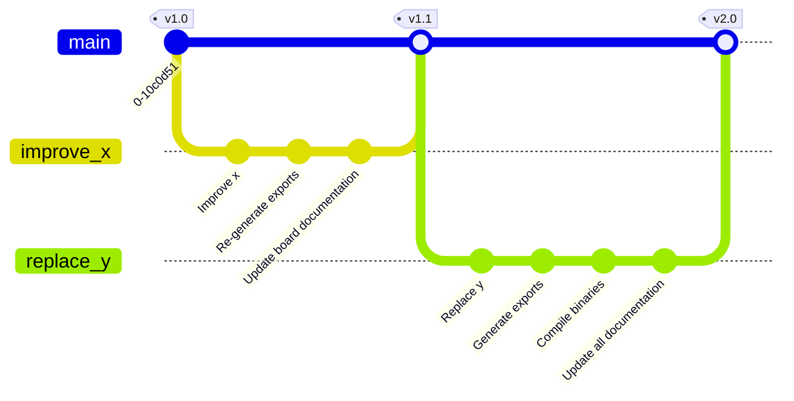

<p align=center>
  
</p>

<p align=center>trailing-edge dimmer for LED bulbs</p>

<div align=center>

  

</div>


**LEDDs** is an open-hardware, DIY smart dimmer designed for 230 V LED bulbs. It is built around the ESP32-C3-12F and is designed to sit on a desk or table, replacing standard inline cord switches.

The project consists of a PCB, a 3D-printable chassis, and a top plate designed as a PCB. It runs [ESPHome](https://esphome.io) for integration with Home Assistant and features a rotary encoder so it can be controlled easily or used as a standalone device.

> [!CAUTION]
> **MAINS VOLTAGE:** This device operates at **230 VAC**. Touching live components can result in serious injury or death.
> * Do not attempt to build this device unless you are experienced with high-voltage electronics.
> * The device must be unplugged from mains power before opening the enclosure.
> * While the design includes safety features (fuse, MOVs), it is not a certified design and should be treated with caution.


## Table of contents
* [Why trailing-edge?](#grey_question-why-trailing-edge)
* [Features](#star-features)
* [Specifications](#straight_ruler-specifications)
* [Release/fabrication of version 2.0](#releasefabrication-of-v20)
* [Repository structure](#open_file_folder-repository-structure)
* [Bill of materials](#euro-bill-of-materials)
* [Build](#hammer-build)
   * [Prerequisites](#prerequisites)
   * [1. Ordering the components](#1-ordering-the-components)
   * [2. PCB assembly instructions](#2-pcb-assembly-instructions)
   * [3. Flashing the firmware](#3-flashing-the-firmware)
   * [4. Preparing the enclosure](#4-preparing-the-enclosure)
   * [5. Final assembly](#5-final-assembly)
* [Usage](#usage)
   * [Control](#control)
   * [LED indicators](#led-indicators)
   * [Default light effects](#default-light-effects)
* [Versions, releases and compatibility](#versions-releases-and-compatibility)
* [Contributing](#contributing)
* [License](#license)

---

## :grey_question: Why trailing-edge?
Most dimmers use **leading-edge** (TRIAC) dimming (designed for incandescent bulbs). They modulate power to the load by cutting the beginning of every AC half cycle. This creates a voltage spike that can cause buzzing and reduced lifespan in the capacitive power supplies found in LED bulbs.

**LEDDs uses trailing-edge dimming.** By using MOSFETs to cut the waveform at the *end* of the AC cycle, the voltage ramps down smoothly. This results in:
* reduced electrical noise and buzzing
* smoother dimming with reduced flicker
* lower minimum brightness levels

## :star: Features
- **ESP32-C3** based with ESPHome firmware for integration with Home Assistant.
- **Standalone** operation, doesn't require Home Assistant.
- **Rotary encoder** control: rotate to dim, press+rotate for effects, press for on/off.
- LEDs: red (rotation feedback), blue (status indicator), white (ambient).
- Included **enclosure design**: 100 mm × 51 mm × 25 mm - ideal for desk lamp modifications.
- Low idle power: ~0.3 W standby consumption
- Open source: MIT licensed

## :straight_ruler: Specifications

| Parameter              | Value                        |
| ---------------------- | ---------------------------- |
| Input voltage          | 230 V AC                     |
| Maximum output power   | 100 W                        |
| Idle power draw        | ~0.3 W                       |
| Protections            | fuse and MOVs                |
| Microcontroller module | ESP32-C3-12F [^1]            |
| Dimensions             | 100 × 51 × 25 mm (W × D × H) |
| Connectivity           | Wi-Fi, USB-C (programming)   |

> [!NOTE]
> Designed for 230 V, 50 Hz AC. Usage with 120 V, 60 Hz AC will possibly require adjusting component values of the zero-cross and the voltage regulator circuits.

---

## Release/fabrication of v2.0


> The fabricated board from release v2.0 works, but has some minor issues: [releaselog.md v2.0][releaselog_v2_0].
> 
> :tada: Recommended for fabrication!

---

## :open_file_folder: Repository structure
```
├── hw/                     # KiCad PCB designs
│   ├── lib/                # symbols and footprints
│   ├── assets/             # fonts and graphics
│   └── export/             # scripts for exporting gerbers, BOM and schematics/PCB PDFs
├── fw/                     # ESPHome YAML configurations and firmware binaries
├── doc/                    # additional documentation
│   ├── releaselog.md       # main PCB release log
│   ├── changelog.md        # main PCB change log
│   └── conventions.md
├── enclosure/
│   ├── chassis/            # 3D printable chassis
│   │   ├── releaselog.md   # chassis release log
│   │   ├── changelog.md    # chassis change log
│   │   ├── vX.Y-variant_a/
│   │   └── vX.Y-variant_b/
│   └── top_plate/          # top plate design
│       ├── releaselog.md   # top plate release log
│       ├── changelog.md    # top plate change log
│       ├── vX.Y-variant_a/
│       └── vX.Y-variant_b/
└── img/                    # photos and renders
```

---
## :euro: Bill of materials
Approximate cost
 - components: €[TBD]
 - PCB: €4 (ordered as prototype board)
 - chassis: €4-10 (when ordered)
 - top plate: €0-4 (can be combined with the main PCB)

See [BOM][dw_bom_v2_0] for complete component list.


## :hammer: Build
### Prerequisites
- Skills: soldering [^2], experience with mains electricity.
- Tools: soldering iron, hot air gun (recommended), 3D printer or access to 3D printing service, multimeter.

### 1. Ordering the components
  - **PCBs**: order the main PCB and the top plate PCB from your preferred fabricator
    - **gerbers** for JLCPCB: [main board], [top plate]
    - for other fabricators - use KiCad to generate gerbers according to the manufactorers instructions
    - see the [release log.md](/docs/releaselog.md) for tested board properties
   - **top plate**:
     Select a top plate from [/enclosure/top_plate/](/enclosure/top_plate/).
   - **Chassis**:
     Select a chassis from [/enclosure/chassis/](/enclosure/chassis/).

### 2. PCB assembly instructions
Use the [interactive BOM][dw_ibom_v2_0] to solder the components.

#### Microcontroller module
<strong>ESP32-C3-12F (recommended)</strong>
- solder R13

<details><summary><strong>ESP8266 ESP-12F (not recommended)</strong></summary>

- solder JP2
- don't solder R13
- don't solder R8 and D5 ("led_3")
- isolate pins 12 and 13 from the PCB pads (with tape)
- don't solder R6 and D3 ("led_1")

ESP8266 doesn't support native USB and requires an external USB to serial adapter for programming.

</details>

#### Zero-cross optoisolator
The PCB has footprints for a choice between 2 optoisolators that connect the zero-cross signal to the MCU.

<strong>H11L1SR2M</strong>
 - solder the optoisolator on footprint U4
 - solder C13
 - don't solder R23

<details><summary>PC817XI (not recommended)</summary>

- solder the optoisolator on footprint U3
- solder R23
- no need to solder C13

This optoisolator is the same as the one used for controlling the MOSFET's gate, but didn't produce good results in my testing.

</details>

#### Skipping the relay
The relay is used to power off the mains part of the circuit when the load is turned off. This is intended as a peace of mind feature, but can be omitted:
 - don't solder K1, C3, D2, R2 and Q1
 - use a wire to short pin 11 to 14
 - use a wire to short pin 21 to 24

#### Skipping the rotary encoder
If the rotary encoder is not required, there is no need to solder R3, R4, C4, C5 and C6. Optionally a push button (SW2) can be soldered so boot mode can be entered manually.

#### Using the UART header instead of the USB for programming *(not tested)*
Solder R12 and header J4, use a USB to serial adapter.

### 3. Flashing the firmware
- Connect to the board via USB-C
- Visit [ESPHome web flasher](https://web.esphome.io/)
- Upload one of the provided binaries:
	- [hass.bin][dw_hass_bin_v2_0]: Home Assistant + rotary encoder
	- [web_server.bin][dw_web_server_bin_v2_0]: self hosted web server + rotary encoder
	- [standalone][dw_standalone_bin_v2_0]: rotary encoder only
- Set your Wi-Fi credentials using the ESPHome web flasher
- Test before wiring

For further customization, the YAML configurations used for creating these binaries are located in [/fw/yaml/](/fw/esphome_yamls/).

### 4. Preparing the enclosure
- Plastic chassis: install the heat-set threaded inserts in the holes using a soldering iron.
- Resin chassis: no preparation needed.

### 5. Final assembly
 - Mount a knob to the rotary encoder.
 - Place the PCB inside the chassis.
 - Screw the mains power cable to the terminal on the left (marked with a power plug). **Don't connect power until fully assembled.**
 - Screw the lamp socket cable to the terminal on the right (marked with a bulb).
 - Pass the screws through the top plate and place the spacers on the screws.
 - Screw the top plate through the PCB into the chassis.


## Usage
### Control
**Directly:**
> *Available in all firmware binaries.*
> It's useful for conveniently controlling the device.

 - **press**: on/off
 - **rotate**: brightness adjustment
 - **press + rotate**: cycle lighting effects

**Home Assistant:**
> *Included in [hass.bin].*

Integrating the device in Home Assistant: (https://esphome.io/guides/getting_started_hassio/#connecting-your-device-to-home-assistant).

![Screenshot of the device in Home Assistant][hass_ui_screenshot]

The "Configuration" section allows customization of the device:
 - **Bulb power rating**: input the power rating of the bulb, this is used for the power estimation sensor ("Power \[est\]").
 - **Gamma correct**: Adjust the gamma correction to achieve linear dimming.
 - **Minimum level**: The lowest level at which the bulb emits light. *Note: this value needs to be updated every time gamma correction is changed.*
 - **Restore mode**: Initial state of the bulb when powered.
 - **Transition length**: How fast the bulb changes brightness in milliseconds.
 - **LED: red/blue/white**: set the ambient brightness of the LEDs.

**Web server:**
> *Included in [web_server.bin].*
> This is useful if you don't have Home Assistant, but want to control the device remotely.

![web_server_ui_screenshot]

### LED indicators
There are three LEDs on the board:
 - **Red (top, led_1):** ambient / rotation feedback
 - **Blue (top, led_2):** ambient / status indicator
 - **White (bottom, led_3):** ambient

### Default light effects
Light effects can be cycled with the rotary encoder or chosen directly from a UI.

<div>
<p align="center">
  
  
  
  
</p>
<p align="center">
  
  
  
  
</p>
</div>

<!-- checklist
1. **Pulse (low, fast)**: pulsing at low brightness, quickly
2. **Pulse (low, slow)**: pulsing at low brightness, slowly
3. **Pulse (high, fast)**: pulsing at high brightness, quickly
4. **Pulse (high, slow)**: pulsing at high brightness, slowly
5. **Pulse (full, fast)**: pulsing from low to high brightness, quickly
6. **Pulse (full, slow)**: pulsing from low to high brightness, slowly
7. **Flicker (soft)**: soft flicker, imitating candle light
8. **Flicker (intense)**: intense flicker, imitating candle light
-->


## Versions, releases and compatibility
Each fabrication run results in a **GitHub release**.
- Semantic versioning (major.minor), no patch versions
- **PCB, chassis, and top plate are versioned independently**
- Same **major versions fit together**

Example layout:
```
enclosure/
├── chassis/
│   ├── v2.0-plastic/
│   ├── v2.1-plastic/
│   └── v2.1-resin/
└── top_plate/
	├── v2.0-default/
	└── v2.0-pcbart/
```


## Contributing
Every type of contribution is welcome, like improvements or corrections on the:
- schematic/PCB design
- documentation
- enclosure (chassis and top panel) design
- ESPHome configuration

Contributions can be made as improvements or as variants (e.g. different enclosure design, ESPHome configuration, etc.).

The procedure is:
- fork
- branch
- commit
- pull request



You're welcome to post photos in [Discussions: Show and tell][discussions_show_and_tell].

## License
This project is licensed under the **MIT License**.

---

**Disclaimer**: This project involves mains voltage electricity. The author assumes no liability for injury, damage, or regulatory violations. Build and use at your own risk. Ensure compliance with local electrical codes and regulations.

[^1]: Also compatible with ESP8266 ESP-12F (not recommended).
[^2]: Hardest component is the USB-C port. The board can be ordered pre-assembled.


<!-- links -->

[releaselog_v2_0]: /doc/releaselog.md#v20---2025-04-02 "/doc/releaselog.md"

[dw_bom_v2_0]: https://github.com/VasilKalchev/LEDDs/releases/download/v2.0/bom.csv "bom.csv from release v2.0"
[dw_ibom_v2_0]: https://github.com/VasilKalchev/LEDDs/releases/download/v2.0/ibom.html "ibom.html from release v2.0"

[dw_hass_bin_v2_0]: https://github.com/VasilKalchev/LEDDs/releases/download/v2.0/hass.bin "full.bin from release v2.0"
[dw_web_server_bin_v2_0]: https://github.com/VasilKalchev/LEDDs/releases/download/v2.0/web_server.bin "web_server.bin from release v2.0"
[dw_standalone_bin_v2_0]: https://github.com/VasilKalchev/LEDDs/releases/download/v2.0/standalone.bin "standalone.bin from release v2.0"
	
[discussions_show_and_tell]: https://github.com/VasilKalchev/LEDDs/discussions/categories/show-and-tell

[hass_ui_screenshot]: 
[web_server_ui_screenshot]: 

<!-- /links -->


<!-- checklist
<details>
<summary>/readme.md checklist</summary>

 - [x] set release result (template in releaselog.md)
 - [x] update the sections as needed
 - [x] comment out this "checklist" and "templates" sections

</details>

-->
<!-- /checklist -->
